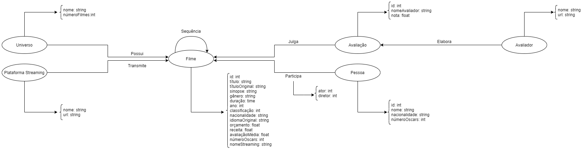

# Aluna
* 222687: Mylena Roberta dos Santos

## Modelo Lógico do Banco de Dados de Grafos

## Perguntas de Pesquisa/Análise
* Qual filme conta com elenco mais premiado com Oscars?
* Qual ator/atriz participou dos melhores filmes de acordo com a crítica?
* Qual diretor/diretora fez os melhores filmes de acordo com a crítica?
* Qual é o gênero de filmes mais rentável?
* Qual é o gênero de filmes melhor avaliado?
* Em que década foram lançados os filmes mais rentáveis?
* Em que década foram lançados os filmes melhores avaliados?
* Qual é o orçamento médio dos filmes mais rentáveis? 
* Qual é o orçamento médio dos filmes melhores avaliados?
* Qual é a sequência de filmes mais rentável?
* Qual é a sequência de filmes melhor avaliada?
* Qual é o universo cinematográfico mais rentável?
* Qual é o universo cinematográfico melhor avaliado?
* Os filmes mais rentáveis também são os mais bem avaliados pela crítica?